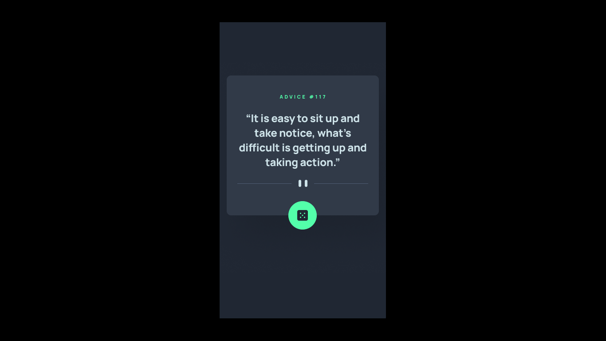

# Challenge 1 - Advice generator app

## The Challenge

The challenge is to build out this advice generator app using the [Advice Slip API](https://api.adviceslip.com) and get it looking as close as possible to [this design](https://www.figma.com/file/5XLmnBEwWWGUtq1Ivnm7ei/advice-generator-app?type=design&node-id=0%3A48&mode=design&t=pmWRv6TxZiAL3eGi-1).

### Users should be able to:

* View the optimal layout for the app depending on their device's screen size.
* See hover states for all interactive elements on the page.
* Generate a new piece of advice by clicking the dice icon.

### Built with:

* HTML
* CSS
* JavaScript

### Deployed with:
* Netlify - https://cm1-advice-generator-app.netlify.app/
